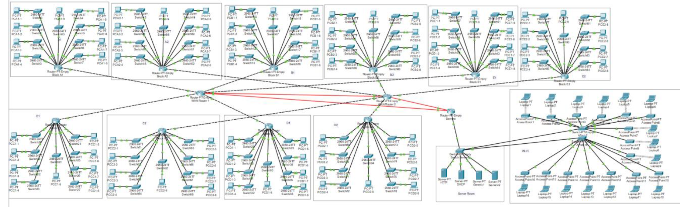
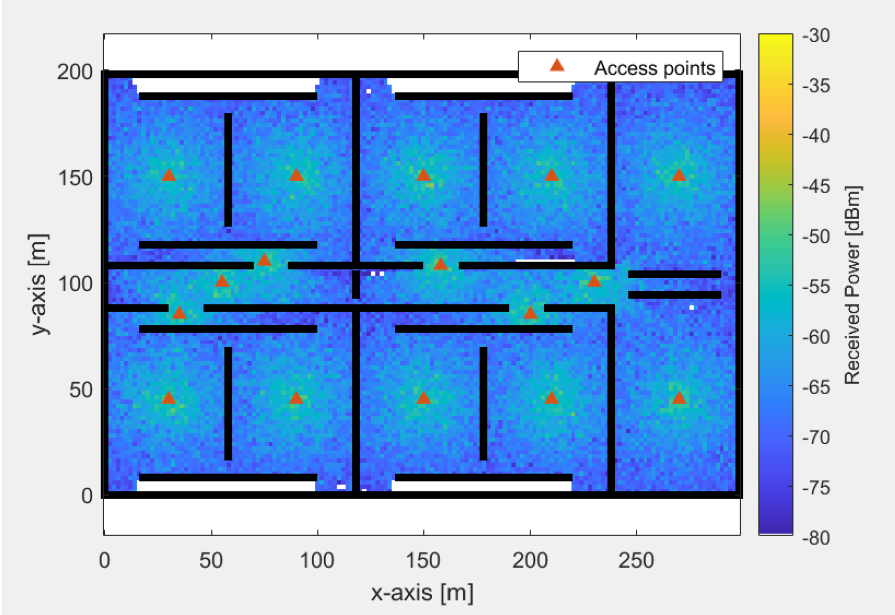

Using Cisco Packet Tracer and MATLAB, the primary objective of this project is to create a network design that supports factory automation by combining wired and wireless networking solutions. The specific goals include:
1. Designing a Wi-Fi network with optimal access point placement to ensure comprehensive coverage and minimal interference.
2. Developing a resilient Ethernet network layout using Cisco Packet Tracer to provide reliable and high-speed wired connectivity.
3. Implementing IP addressing, DHCP, and HTTP services.
4. Optimizing Wi-Fi coverage and minimizing interference through strategic access point placement.
5. Testing the design through test runs and MATLAB simulation of signal strength.

Network design using Cisco Packet Tracer:

Signal strength simulation using MATLAB:

